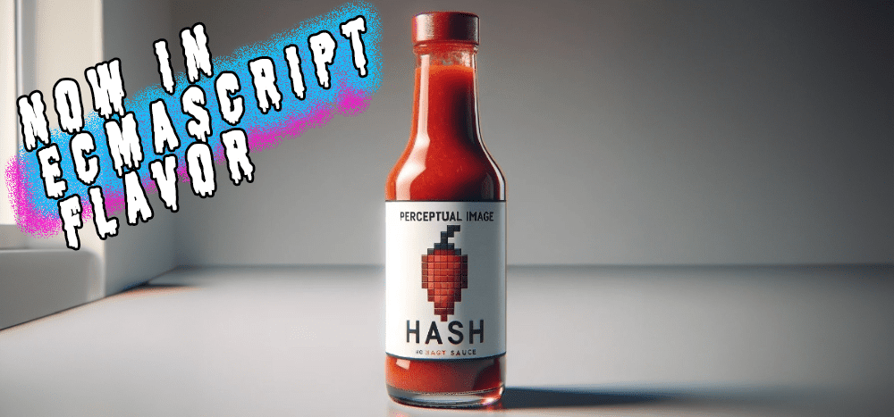

# dads-original-perceptual-hash



Now with a spicy nodejs flavoring (both artificial and natural additives included).

Sharp-based implementation of perceptual hash (phash) algorithm. My main man Denis wrote this and I just refactored it and added a test and a shitty logo.

## How to use
Takes in file buffer and returns a promise that resolves to a binary phash.

```js
import {phash, distance} from 'sharp-phash'

import fs from 'fs/promises'

const main = async () => {
    const img1 = await fs.readFile('./test.png')
    const img2 = await fs.readFile('./test1.png')

    const hash1 = await phash(img1)
    const hash2 = await phash(img2)
    assert(dist(hash1, hash2) < 5)
}
main()
```

## How it really works: the details
I'm not really sure. Math, maybe?